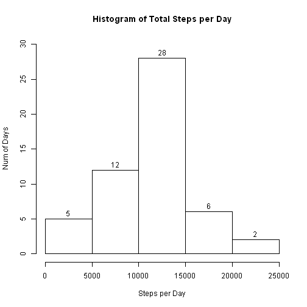
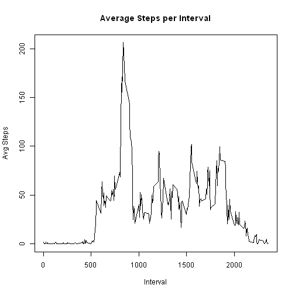
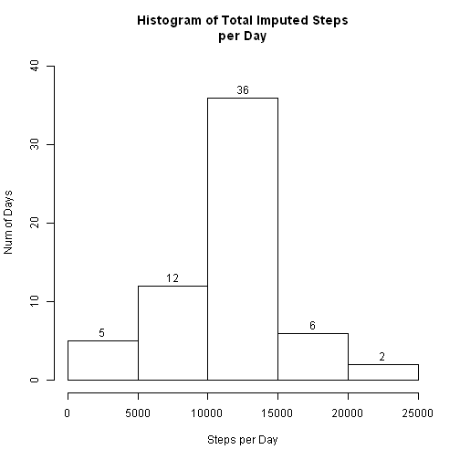
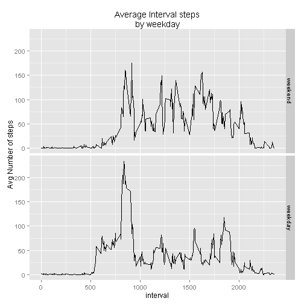

## Loading and preprocessing the data 

#### 1. Load the data 

```r
unzip('activity.zip')
activityMonitor <- read.csv("activity.csv")
```
  
#### 2. Process/transform the data (if necessary) into a format suitable for your analysis

```r
# Create datetime field
library(lubridate)
datetime <- strptime( paste(activityMonitor$date, sprintf("%.2f", activityMonitor$interval/100)), "%Y-%m-%d %H.%M")
activityMonitor <- cbind( activityMonitor, datetime)
activityMonitor$TimeInterval <- hm(format(activityMonitor$datetime, '%H:%M'))
```

## What is mean total number of steps taken per day?

#### 1.	Calculate the total number of steps taken per day

```r
stepsByDay <- aggregate( steps ~ date, data = activityMonitor, sum )
```

#### 2. Make a histogram of the total number of steps taken each day

```r
hist(stepsByDay$steps, labels = TRUE, ylim = c(0,30), xlab = "Steps per Day",ylab = "Num of Days",  main = "Histogram of Total Steps per Day")
```

 

#### 3. Calculate and report the mean and median total number of steps taken per day

```r
c(mean = mean(stepsByDay$steps), median = median(stepsByDay$steps))
```

```
##     mean   median 
## 10766.19 10765.00
```

## What is the average daily activity pattern?
#### 1. Make a time series plot (i.e. type = "l") of the 5-minute interval (x-axis) and the average number of steps taken, averaged across all days (y-axis)

```r
avgStepsByInt <-  aggregate( steps ~ interval, data = activityMonitor, mean )
plot(x = avgStepsByInt$interval, y = avgStepsByInt$steps, type = 'l', xlab = 'Interval', ylab = 'Avg Steps', main = 'Average Steps per Interval')
```

 

#### 2. Which 5-minute interval, on average across all the days in the dataset, contains the maximum number of steps?

```r
maxInterval <- avgStepsByInt[ avgStepsByInt$steps == max( avgStepsByInt$steps),]
maxInterval
```

```
##     interval    steps
## 104      835 206.1698
```
The maximum average steps of 206.1698113  occurred at the 835 interval.

## Imputing missing values

#### 1. Calculate and report the total number of missing values in the dataset (i.e. the total number of rows with NAs)

```r
NASteps <- ifelse(is.na(activityMonitor$steps), TRUE, FALSE)
table( 'Count of Missing Steps' = NASteps)
```

```
## Count of Missing Steps
## FALSE  TRUE 
## 15264  2304
```
*NB. The TRUE values indicate the number of NA values in the dataset.

#### 2. Devise a strategy for filling in all of the missing values in the dataset. The strategy does not need to be sophisticated.  For example, you could use the mean/median for that day, or the mean for that 5-minute interval, etc.
Use the Average Steps per interval over the complete dataset to fill in NA values.

#### 3. Create a new dataset that is equal to the original dataset but with the missing data filled in.

```r
impActivityMonitor <- merge(activityMonitor, avgStepsByInt, by = 'interval', all = TRUE)  
impActivityMonitor <- transform(impActivityMonitor, ImputedSteps = ifelse(is.na(impActivityMonitor$steps.x), impActivityMonitor$steps.y, impActivityMonitor$steps.x))
library(plyr)
impActivityMonitor <- arrange(impActivityMonitor, datetime)
```

#### 4. Make a histogram of the total number of steps taken each day and Calculate and report the mean and median total number of steps taken per day. 

```r
impStepsByDay <- aggregate( ImputedSteps ~ date, data = impActivityMonitor, sum )
hist(impStepsByDay$ImputedSteps, labels = TRUE, ylim = c(0,40), xlab = "Steps per Day",ylab = "Num of Days",  main = "Histogram of Total Imputed Steps\nper Day")
```

 

```r
impStepSummary <- c(mean = mean(impStepsByDay$ImputedSteps), median = median(impStepsByDay$ImputedSteps))
impStepSummary
```

```
##     mean   median 
## 10766.19 10766.19
```

#### Do these values differ from the estimates from the first part of the assignment?  
The histogram shows an increase from 28 to 36 days in the 10,000 to 15,00 steps per day range.  Although the Mean is the same in both instanses, the Median value has increased by 1.19 steps on average.  

#### What is the impact of imputing missing data on the estimates of the total daily number of steps?
Imputing the missing values has increased the number of days in the Mean range.  This is the byproduct of using the Interval average steps to complete the missing values.  Now more days not represented in the original dataset now fall into the Mean interval here.

## Are there differences in activity patterns between weekdays and weekends?

#### 1. Create a new factor variable in the dataset with two levels - "weekday" and "weekend" indicating whether a given date is a weekday or weekend day.

```r
activityMonitor$weekday <- ifelse (weekdays(activityMonitor$datetime) %in% c('Saturday', 'Sunday'), 'weekend', 'weekday')
activityMonitor$weekday <- factor(activityMonitor$weekday, levels = c('weekend', 'weekday'))
```

#### 2. Make a panel plot containing a time series plot (i.e. type = "l") of the 5-minute interval (x-axis) and the average number of steps taken, averaged across all weekday days or weekend days (y-axis).

```r
avgStepsIntbyWeekday <-  aggregate( steps ~ interval + weekday, data = activityMonitor, mean )

library(ggplot2)
g <- ggplot(avgStepsIntbyWeekday, aes( x = interval, y = steps) )
g + facet_grid(weekday ~ .) +
  geom_line() +
  ylab("Avg Number of steps") + 
  ggtitle("Average Interval steps\nby weekday") 
```

 
